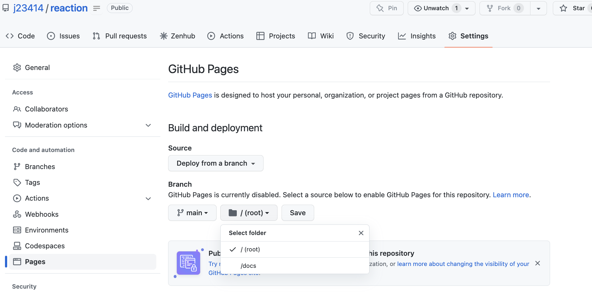

# Reaction

React Java Script

## Init

```
npx create-react-app reaction
```

Creates boilerplate, seems to have many files...

```
reaction/
  |_ node_modules/ # contains npm dependencies, many files here...
  |_ public/ # immutable pages?
  |_ src/ # react/javascript?
  |
  |_ package.json
  |_ package-lock.json
  |_ README.md
```

Start github pages although not seeing a drop down toward `public`.


